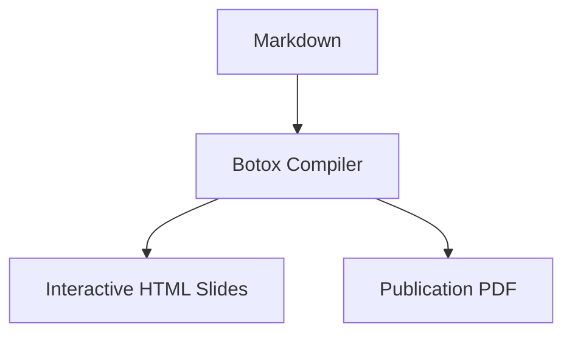
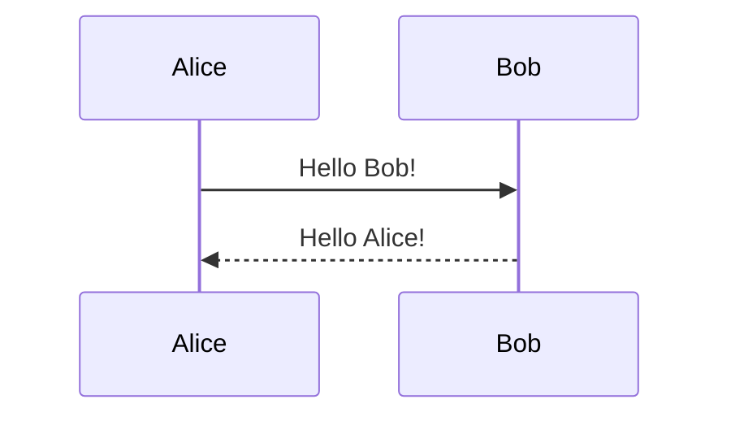

# Botox: Publication-Grade Typesetting & Presentations

Botox is a high-performance, single native binary document compiler written in pure Rust. It transforms standard Markdown into LaTeX-quality PDF documents or interactive HTML slide decks using an in-process Typst engine.

## Command Line Usage

### Basic Commands
```bash
# 1. Initialize a new document or presentation
botox init document.md               # Create a new academic PDF document template
botox init slides.md                 # Create a new presentation slide deck template

# 2. Compile documents (PDF is default for documents)
botox document.md                    # Compiles to document.pdf
botox document.md -o custom.pdf      # Explicit output path
botox document.md -o custom.html     # Export document to HTML

# 3. Compile presentations (HTML is default for slides)
botox slides.md                      # Compiles to interactive slides.html
botox slides.md -o deck.pdf          # Export slides to PDF

# 4. Live watch mode (recompiles on change)
botox -w document.md
botox --watch slides.md

# 5. Unix pipeline mode (stream compiled PDF directly to stdout)
cat document.md | botox - -o - > output.pdf

# 6. Configuration & Setup
botox config                         # Show active configuration and loaded sources
botox setup                          # Interactive setup wizard
botox setup --global --author "Name" # Non-interactive configuration
botox --skills                       # Generate this skill file for AI agents
```

### CLI Options Reference
| Flag | Description |
| :--- | :--- |
| `-o, --output <file>` | Destination file (`.pdf`, `.html`, `.svg`, `.json`, or `-` for stdout) |
| `-w, --watch` | Watch input file and directory for changes and recompile automatically |
| `--pdf` | Force PDF output mode |
| `--slides` | Force presentation slide deck mode |
| `--theme <theme>` | Document theme (`academic`, `modern`, `elegant`, `technical`, `compact`, `minimal`) or Slide theme (`default`, `academic`, `gaia`, `uncover`, `nord`, `dark`) |
| `--toc` / `--no-toc` | Enable or disable automatic Table of Contents |
| `--author <name>` | Author name (overrides frontmatter and config) |
| `--font <name>` | Main font (default: New Computer Modern) |
| `-N, --number-sections` | Automatically number section headings |
| `-b, --bibliography` | Transform hyperlinks into an IEEE-standard Bibliography |
| `--no-bibliography` | Disable automatic bibliography generation |
| `--exclude-ref <patterns>` | Exclude matching URL patterns/domains from bibliography |
| `--include-ref <patterns>` | Only include matching URL patterns/domains in bibliography |

---

## Document Frontmatter Reference

Documents use YAML frontmatter at the top of the Markdown file:

```yaml
---
title: "Document Title"
subtitle: "Document Subtitle"
author:
  - name: "Author Name"
    affiliation: "Organization or University"
date: \today
lang: en
papersize: a4                        # a4, us-letter
fontsize: 11pt                       # 10pt, 11pt, 12pt
mainfont: "New Computer Modern"      # Any installed system font
geometry: "margin=2.5cm"
number-sections: true
table-of-contents: true
toc-depth: 3
bibliography: true                   # Turns hyperlinks into IEEE citations
theme: academic                      # academic, modern, elegant, technical, compact, minimal
---

# Introduction

Body text goes here...
```

### Document Themes
* **`academic`** (default): Traditional LaTeX / Computer Modern style with serif typography and clean rules.
* **`modern`**: Clean sans-serif headings, subtle blue accents, and open margins.
* **`elegant`**: Sophisticated editorial layout suitable for books, essays, and long-form writing.
* **`technical`**: Monospace accents, sharp borders, structured headers for RFCs and engineering specs.
* **`compact`**: Space-efficient layout optimized for summaries and multi-column papers.
* **`minimal`**: Pure, distraction-free typography without decorative elements.

---

## Presentation Slides Reference

Slide decks are separated into individual slides using horizontal rules (`---`) or `\newpage`:

```yaml
---
marp: true
theme: default                       # default, academic, gaia, uncover, nord, dark
paginate: true                       # Show slide numbers
header: "Company Confidential"
footer: "Quarterly Review"
---

# Presentation Title
### Subtitle or Speaker Name

---

# Key Objectives

- High performance native Rust compilation
- Direct conversion to interactive HTML slides
- Full support for mathematics and diagrams

---

# Architecture Overview


```

### Slide Themes
* **`default`**: Clean, modern light theme.
* **`academic`**: Traditional academic beamer style.
* **`gaia`**: Warm terracotta and earth tones (Marp compatible).
* **`uncover`**: High-contrast minimalist style with centered content.
* **`nord`**: Cool Arctic frost dark theme.
* **`dark`**: Sleek slate and charcoal dark mode.

---

## Mathematics Typesetting

Botox supports native Typst/LaTeX mathematical syntax:

* **Inline Math**: Enclose equations in single dollar signs: `$E = m c^2$`
* **Display Math**: Enclose equations in double dollar signs:
  ```latex
  $$\int_{-\infty}^{+\infty} e^{-x^2} \, dx = \sqrt{\pi}$$
  ```
* **Equation Labels & Cross-References**:
  ```latex
  $$\vec{F} = m \frac{d\vec{v}}{dt}$$ {#eq:force}

  As defined in @eq:force, force equals mass times acceleration.
  ```

---

## Diagram Rendering (Kroki & Mermaid)

Botox natively compiles diagram code blocks into sharp, scalable vector graphics:

````markdown

````

Supported diagram engines:
* `mermaid` (flowcharts, sequence, class, state, gantt, gitGraph)
* `plantuml` / `puml`
* `graphviz` / `dot`
* `d2`
* `bytefield`
* `c4plantuml`

Diagrams can also have captions and reference labels:
````markdown
```{mermaid, caption="System Architecture", id="fig:arch"}
graph LR;
  Client --> Gateway --> Service;
```

See the system architecture in @fig:arch.
````

---

## Callout Advisory Blocks

Botox supports both GitHub-style and Pandoc-style advisory callouts:

### GitHub Style Callouts
```markdown
> [!NOTE]
> Useful background context or explanations.

> [!TIP]
> Pro-tip for optimizing workflow performance.

> [!WARNING]
> Critical warning regarding security or data loss.

> [!IMPORTANT]
> Essential steps that must not be skipped.
```

### Pandoc Style Divs
```markdown
::: note
**Pandoc Style**: Cleanly rendered with theme-aware borders.
:::

::: warning
**Caution**: High voltage area!
:::
```

---

## Bibliographies & Cross-Referencing

* **Automatic Link Bibliography**: Enable with `bibliography: true` in frontmatter or `-b` in CLI. Hyperlinks in the text are transformed into IEEE citation indices `[1]`, with a bibliography at the end of the document.
* **Manual References Command**:
  ```markdown
  Check out [Rust](https://rust-lang.org) and [Typst](https://typst.app).

  \ref Sources and References
  ```
* **Filtering Links**: Use `exclude-references: ["github.com", "x.com"]` or `--exclude-ref` to prevent non-academic links from appearing in the bibliography.
