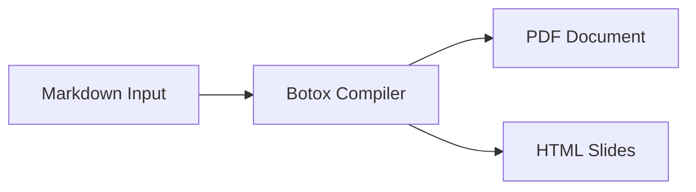
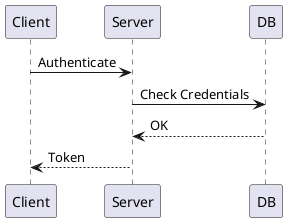

# Introduction {#sec:intro}

Botox is a pure Rust compiler that turns Markdown documents into PDF files or HTML presentation slides. It embeds a native typesetting engine, so it does not require LaTeX, Node.js, Python, or Chromium to be installed on your machine.

This document describes all features implemented in Botox and tests their compilation.

# Mathematics {#sec:math}

Botox renders math using New Computer Modern fonts. You can write inline formulas like $E = m c^2$ or $\vec{F} = m \vec{a}$, as well as display equations.

## Standard Display Equations

Display equations are enclosed in double dollar signs and can include Pandoc labels:

$$
\int_{-\infty}^{+\infty} e^{-x^2} \, dx = \sqrt{\pi}
$$ {#eq:gaussian}

Equation @eq:gaussian is referenced using Pandoc cross-reference syntax. You can also write infinite series, fractions, and square roots:

$$
\sum_{k=0}^{\infty} \frac{x^k}{k!} = e^x, \qquad \lim_{n \to \infty} \left(1 + \frac{1}{n}\right)^n = e
$$ {#eq:limits}

## Matrices and Cases

Parenthesized matrices (`pmatrix`), bracketed matrices (`bmatrix`), and piecewise functions (`cases`) work out of the box:

$$
\begin{pmatrix}
1 & 0 & 0 \\
0 & 1 & 0 \\
0 & 0 & 1
\end{pmatrix}
\qquad
\begin{bmatrix}
a & b \\
c & d
\end{bmatrix}
$$ {#eq:matrices}

Piecewise definitions use standard LaTeX `cases`:

$$
f(x) = \begin{cases}
x^2 & \text{if } x \ge 0 \\
-x & \text{if } x < 0
\end{cases}
$$ {#eq:cases}

# Diagrams and Visuals {#sec:diagrams}

Diagrams are compiled to vector SVG graphics via Kroki and cached locally in `~/.cache/botox/diagrams/` for fast repeated builds.

## Inline Mermaid and PlantUML



Figure @fig:mermaid-pipeline shows the pipeline. PlantUML is also supported:



## UMLet Diagrams

Botox supports UMLet (`.uxf` format) diagrams both inline and via file references:

```umlet {caption="Inline UMLet Class Box" width=50% #fig:umlet-inline}
<diagram program="umlet">
  <zoom_level>10</zoom_level>
  <element>
    <id>UMLClass</id>
    <coordinates><x>10</x><y>10</y><w>120</w><h>50</h></coordinates>
    <panel_attributes>Document
--
+ pages: int</panel_attributes>
  </element>
</diagram>
```

## Diagram File Referencing

You can reference external diagram files directly without copying their contents:

1. Through fence file attributes:
```umlet file="architecture.uxf" {caption="Referenced UMLet Architecture" #fig:umlet-file}
```

2. Through PlantUML include statements:
```puml {caption="Included PlantUML Sequence" #fig:puml-inc}
!include pipeline.puml
```

3. Through standard Markdown image syntax:
{#fig:umlet-img width=60%}

Figure @fig:umlet-file and Figure @fig:umlet-img reference external diagram files.

# External Code File Referencing {#sec:code}

Code blocks can include external source files directly using the `file` attribute:

```rust file="sample.rs"
```

# Structured Tables {#sec:tables}

Tables support alignment, captions, and cross-references:

Table: Botox compilation target summary. {#tbl:targets}

| Target | File Extension | Engine | Offline Caching |
| :--- | :---: | :---: | ---: |
| Document | `.pdf` | Typst | Yes |
| Slides | `.html` | Custom HTML5 | Yes |
| Diagrams | `.svg` | Kroki / mermaid.ink | Yes |

As shown in Table @tbl:targets, both document and presentation outputs are fully self-contained.

# Callouts {#sec:callouts}

Botox supports both GitHub-style callouts and Pandoc-style advisory divs.

> [!NOTE]
> This is a GitHub-style note callout for background information.

> [!TIP]
> Use `-w` or `--watch` to recompile automatically when files change.

> [!WARNING]
> Keep your diagrams valid so Kroki can generate vector output.

::: important
**Pandoc Style Div**: This is an important announcement rendered with a colored frame.
:::

# Page Breaks and Date Macro {#sec:structure}

You can insert manual page breaks using `\newpage`, `\pagebreak`, or `<!-- pagebreak -->`.

Document generated on \today.

# References {#sec:refs}

External web links in the document are converted into IEEE numerical citations in the bibliography when bibliography mode is enabled:
* Read the [Typst Documentation](https://typst.app/docs/) for typesetting details.
* Read the [Rust Language Guide](https://www.rust-lang.org) for systems programming notes.
* Links to github like [Botox Repository](https://github.com/botoxMD/botox-cli) are excluded from the bibliography via frontmatter rules.

\ref "Works Cited"
