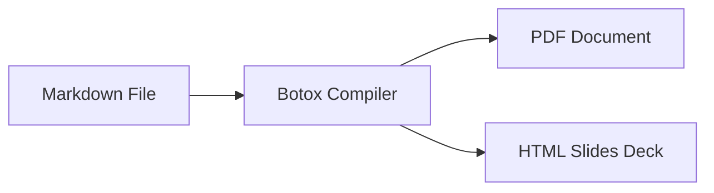

# Botox Overview

* Pure Rust compiler for Markdown to PDF and HTML slides
* Zero external toolchain dependencies (no TeX Live, no Pandoc, no Node.js)
* Fast local caching for diagrams and fonts

<!-- pause -->

* Built-in presentation viewer with keyboard navigation and fullscreen support

---

# Mathematics on Slides

Inline math: $E = m c^2$ and $\nabla \cdot \mathbf{B} = 0$

Display equations with integrals and limits:

$$
\int_{-\infty}^{\infty} e^{-x^2} \, dx = \sqrt{\pi}
$$

<!-- pause -->

Matrix calculations:

$$
\begin{bmatrix}
\cos(\theta) & -\sin(\theta) \\
\sin(\theta) & \cos(\theta)
\end{bmatrix}
\begin{pmatrix}
x \\
y
\end{pmatrix}
$$

---

# Architecture Diagram



<!-- pause -->

```umlet file="architecture.uxf"
```

---

# Referenced Source Code

External source files load directly with syntax highlighting:

```rust file="sample.rs"
```

---

# Tables and Callouts

| Feature | PDF Document | HTML Slides |
| :--- | :---: | :---: |
| Math | Full LaTeX | KaTeX / SVG |
| Diagrams | SVG Vector | SVG Vector |
| Incremental Pauses | No | Yes (`\pause`) |

<!-- pause -->

> [!TIP]
> Press `F` during slide presentation to toggle fullscreen mode.
> Use Left/Right arrow keys or Spacebar to navigate steps.

---

# Summary

* Single binary toolchain
* Covers documents, presentations, math, diagrams, tables, and callouts
* File referencing allows clean modular Markdown projects
